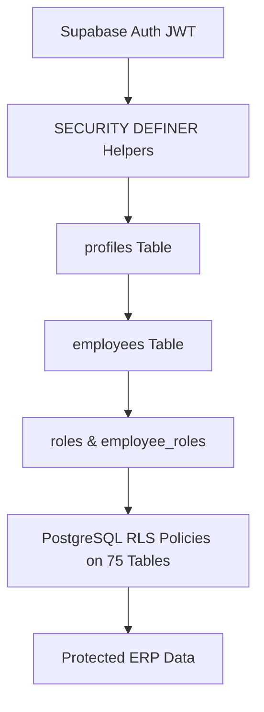

# GPS Spindle ERP — Enterprise Security & Row Level Security (RLS) Architecture

## 1. Security Overview & Defense-in-Depth Model

GPS Spindle ERP implements a strict **defense-in-depth architecture** where authorization is enforced at the database layer via **PostgreSQL Row Level Security (RLS)**.



> [!IMPORTANT]
> **Database as Real Security Boundary**:
> Frontend route protection and sidebar permission filters are solely for user experience and navigation. Even if an attacker manipulates browser memory, DevTools, or executes direct Supabase REST queries, the PostgreSQL database kernel enforces access rules via RLS policies and rejects unauthorized requests with HTTP 403 / PostgreSQL error `42501`.

---

## 2. Authentication Architecture
- **Supabase Auth**: Authenticates users using email/password and returns a cryptographically signed JWT.
- **Tokens**: Client sessions are persisted with secure automatic token refresh (`persistSession: true`, `autoRefreshToken: true`).
- **Zero Service-Role Exposure**: The application codebase uses only the public anonymous key (`VITE_SUPABASE_ANON_KEY`). Service-role credentials are strictly confined to administrative offline scripts (`.env.migration`) and are ignored in production builds.

---

## 3. Role Resolution & Hierarchy
The system connects identity across 4 relational hops evaluated securely on the database side via `SECURITY DEFINER` functions:

```text
auth.users.id
     ↓
profiles.id (UUID = auth.uid())
     ↓
employees (profile_id = profiles.id OR email = auth.email)
     ↓
employee_roles (junction) / roles
     ↓
role_permissions
```

### The 9 Defined ERP Roles:
1. **`ADMIN`**: Plant Administrator — Full access across all 75 tables, configuration, roles, and master data.
2. **`MANAGEMENT`**: Executive Leadership — Operational visibility across production, commercial, quality, finance, and immutable audit logs.
3. **`PROD_MGR`**: Production Manager — Full control of work orders, machine bays, shop floor operations, spindle assembly, and workforce logs.
4. **`QA_MGR`**: Quality Assurance Manager — Full control of metrology inspections, ISO certificates, non-conformance reports (NCR), and testing.
5. **`SALES`**: Commercial Desk — Enquiries, costing quotations, sales orders, proforma invoices, invoices, E-Way bills, and client master directory.
6. **`PURCHASE`**: Procurement Lead — Purchase requisitions, purchase orders, vendor directory, and incoming material receipts.
7. **`STORES`**: Warehouse Manager — Inventory catalog, bin stock levels, warehouse transfers, goods receipts (GRN), and dispatch crates.
8. **`SERVICE`**: Spindle Service Specialist — 9-stage spindle rebuild pipeline, service jobs, warranty history, and asset maintenance.
9. **`EMPLOYEE`**: Precision Machinist / Operator — Own work logs, own attendance clock-in/out, own leave submissions, and task allocation.

---

## 4. Role Access Matrix

| Functional Domain | Tables Covered | Allowed Roles (Read / Write) | Restricted / Denied Roles |
| :--- | :--- | :--- | :--- |
| **Organization Master** | `companies`, `branches`, `departments`, `locations` | Read: All authenticated<br>Write: `ADMIN`, `MANAGEMENT` | Write denied to all non-executives |
| **Profiles & Directory** | `profiles`, `employees` | Read: All authenticated<br>Update: Owner (personal fields only) / Admin | Reassigning roles or employee codes denied |
| **RBAC Configuration** | `roles`, `permissions`, `role_permissions`, `employee_roles` | Read: All authenticated<br>Write: **`ADMIN` ONLY** | All non-administrators strictly denied write |
| **Workforce Attendance** | `attendance`, `leave_requests`, `shifts` | Read: Owner, `PROD_MGR`, Admin<br>Write: Owner (own clock/leave) / Admin | Modifying peers' attendance strictly denied |
| **Manufacturing** | `production_bays`, `machines`, `production_operations`, `machine_assignments` | Read: All authenticated<br>Write: `PROD_MGR`, `MANAGEMENT`, `ADMIN` | Operators and commercial staff denied write |
| **Spindle Fleet** | `spindle_models`, `spindles`, `spindle_components`, `digital_twins` | Read: All authenticated<br>Write: `PROD_MGR`, `QA_MGR`, `SERVICE`, Admin | General staff denied write |
| **Work Orders & Logs** | `work_orders`, `work_order_items`, `work_logs` | Read/Write: `PROD_MGR`, `MANAGEMENT`, Admin<br>Logs: Owner operators can read/insert/update own | Modifying other operators' logs denied |
| **Metrology & Quality** | `inspections`, `inspection_results`, `quality_certificates`, `non_conformances`, `spindle_quality_records` | Read: All authenticated<br>Write: `QA_MGR`, `MANAGEMENT`, `ADMIN` | Non-QA staff denied write |
| **Commercial Sales** | `customers`, `customer_contacts`, `enquiries`, `quotations`, `sales_orders` | Read/Write: `SALES`, `MANAGEMENT`, `ADMIN` | Production and store staff denied write |
| **Financial Invoicing** | `proforma_invoices`, `invoices`, `eway_bills`, `payment_records` | Read/Write: `SALES`, `MANAGEMENT`, `ADMIN` | **Machinists, QA, Stores, and Service strictly DENIED** |
| **Procurement** | `suppliers`, `purchase_requisitions`, `purchase_orders`, `goods_receipts` | Read/Write: `PURCHASE`, `STORES`, `MANAGEMENT`, `ADMIN` | Non-procurement staff denied PO modifications |
| **Inventory & Stock** | `product_categories`, `products`, `warehouses`, `stock` | Read: All authenticated<br>Write: `STORES`, `PURCHASE`, `PROD_MGR`, Admin | General employees denied write |
| **Stock Ledger** | `stock_movements`, `inventory_transactions` | Insert: Authorized operational roles<br>Update/Delete: **`ADMIN` ONLY** | Immutable ledger; history rewriting blocked |
| **Service & Assets** | `service_requests`, `service_jobs`, `service_history`, `assets`, `maintenance_orders` | Read: All authenticated<br>Write: `SERVICE`, `PROD_MGR`, Admin | General employees denied write |
| **Logistics** | `transporters`, `vehicles`, `dispatches`, `dispatch_items` | Read/Write: `SALES`, `STORES`, `MANAGEMENT`, `ADMIN` | General employees denied write |
| **Employee Expenses** | `expenses`, `expense_items` | Read/Write: Owner employee, `MANAGEMENT`, `ADMIN` | Viewing other employees' claims denied |
| **Audit Logs** | `audit_logs` | Read: `ADMIN`, `MANAGEMENT`<br>Insert: Authenticated service<br>**Update/Delete: DENIED TO ALL** | **100% Immutable Security Audit Trail** |

---

## 5. Security Helper Functions (`015_security_helpers.sql`)

All helper functions are compiled as `SECURITY DEFINER` with explicit `SET search_path = public`:
1. `get_current_profile_id()`: Returns `auth.uid()`.
2. `get_current_employee_id()`: Resolves employee ID for the active JWT session.
3. `get_current_user_roles()`: Resolves assigned role codes across `profiles`, `employees`, and `employee_roles`.
4. `has_role(required_role)`: Evaluates role membership.
5. `has_any_role(VARIADIC required_roles)`: Evaluates multi-role membership.
6. `is_admin()`: Verifies if caller possesses `ADMIN` role.
7. `is_management()`: Verifies if caller possesses `ADMIN` or `MANAGEMENT` role.
8. `is_same_employee(employee_id)`: Checks ownership matching `get_current_employee_id()`.
9. `has_permission(permission_code)`: Granular capability check against `role_permissions`.

---

## 6. Privilege Escalation Defenses & Triggers

To prevent privilege escalation attacks:
1. **Trigger `trg_prevent_profile_escalation`**:
   - Executes `BEFORE UPDATE ON public.profiles`.
   - Rejects any non-administrator attempt to change `role_id` or user `id`.
2. **Trigger `trg_prevent_employee_escalation`**:
   - Executes `BEFORE UPDATE ON public.employees`.
   - Rejects any non-administrator attempt to alter `role_id`, `employee_code`, or `department_id`.
3. **Role Table Lockdown**:
   - `roles`, `permissions`, `role_permissions`, and `employee_roles` are writable **ONLY by ADMIN**.
   - Non-administrators cannot insert themselves into `employee_roles` or update mappings.

---

## 7. Storage Bucket Security (`020_storage_security.sql`)

| Storage Bucket | Visibility | File Size Limit | Allowed MIME Types | Access Rules |
| :--- | :--- | :--- | :--- | :--- |
| **`spindle-documents`** | **PRIVATE** | 50 MB | PDF, PNG, JPG, DXF, STEP, IGES | Read: Authenticated<br>Upload: Production, QA, Service, Admin |
| **`quality-reports`** | **PRIVATE** | 20 MB | PDF, PNG, JPG, XLSX | Read: Authenticated<br>Upload: QA Manager & Admin only |
| **`invoices-ewb`** | **PRIVATE** | 10 MB | PDF, PNG, JPG | Read/Upload: Sales, Management & Admin only |
| **`avatars`** | **PUBLIC** | 5 MB | PNG, JPG, WEBP, SVG | Read: Public<br>Upload: Authenticated users (own avatar) |

---

## 8. Frontend Error Handling & Anti-Mock Directives

In [`src/services/database/baseService.js`](file:///c:/Users/SAHIL/Downloads/ERP/src/services/database/baseService.js):
- Intercepts PostgreSQL / Supabase RLS error codes (`42501`, `PGRST301`, `permission denied`, `violates row-level security policy`).
- Sanitizes error payloads into `{ error: { code: 'PERMISSION_DENIED', message: 'You do not have permission to perform this action.' } }`.
- **Absolute Rule: `DENIED = DENIED`**. Failed database queries never silently substitute mock data in authenticated sessions.

---

## 9. How to Apply Migrations to Supabase Cloud

> [!WARNING]
> **Pending Live Deployment**:
> The 75 relational PostgreSQL application tables from Phase 2 and the RLS migrations from Phase 4 have been generated and validated statically in the repository, but have not yet been executed in the Supabase Cloud SQL Editor.

### Deployment Procedure:
1. Open your browser and log into the **Supabase Dashboard SQL Editor**:
   `https://supabase.com/dashboard/project/eefqamtethlkqhqgdpah/sql/new`
2. Open [`supabase/complete_schema.sql`](file:///c:/Users/SAHIL/Downloads/ERP/supabase/complete_schema.sql) (169 KB).
3. Copy the entire file content, paste it into the Supabase SQL Editor, and click **Run**.
4. All 75 tables, 68 indexes, triggers, seed data, security helper functions, and 172 Row Level Security policies will be created and activated live.

---

## 10. Security Verification Scripts

Run the automated security test suite locally:
```powershell
# 1. Audit RLS coverage across all 75 tables
node scripts/audit_rls_policies.js

# 2. Run privilege escalation attacks and role authorization suite
node scripts/test_rls.js

# 3. Check for linting errors
npm run lint

# 4. Verify clean production build
npm run build
```
